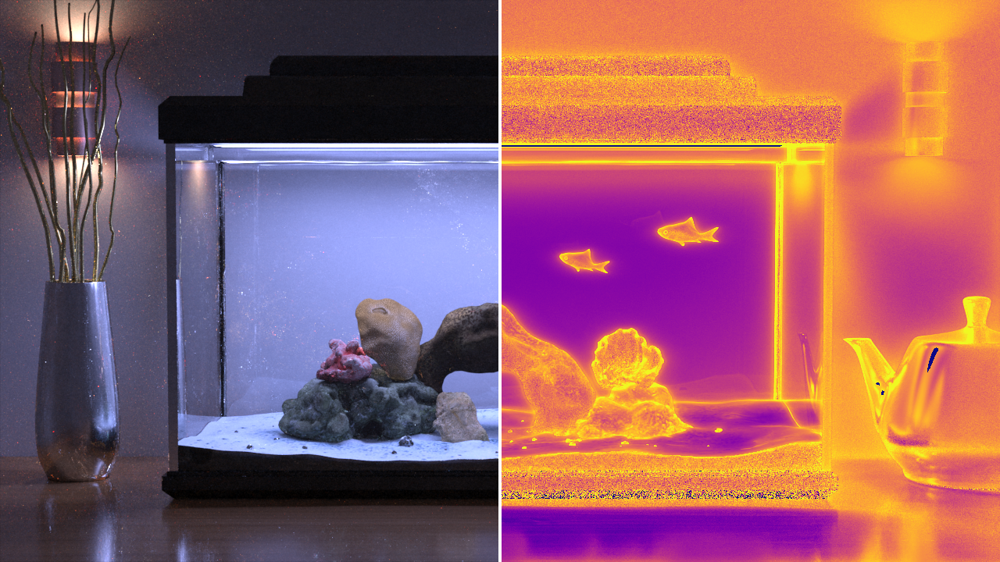

# Delayed Rejection Metropolis Light Transport

Damien Rioux-Lavoie&ast;, Joey Litalien&ast;, Adrien Gruson, Toshiya Hachisuka, and Derek Nowrouzezahrai



## Abstract

Designing robust mutation strategies for primary sample space Metropolis light transport is a challenging problem: poorly-tuned mutations both hinder state space exploration and introduce structural image artifacts. Scenes with complex materials, lighting and geometry make hand-designing strategies that remain optimal over the entire state space infeasible. Moreover, these difficult regions are often sparse in state space, and so relying exclusively on intricate (often expensive) proposal mechanisms can be wasteful where simpler inexpensive mechanisms are more sample efficient. We generalize Metropolis&ndash;Hastings light transport to employ a flexible two-stage mutation strategy based on delayed rejection [Green & Mira 2001; Tierney & Mira 1999]. Our approach generates multiple proposals based on the failure of previous ones, all while preserving Markov chain ergodicity. This allows us to reduce error while maintaining fast global exploration and low correlation across chains. Direct application of delayed rejection to light transport leads to low acceptance probabilities, and so we also propose a novel transition kernel to alleviate this issue. We benchmark our approach on several applications including _bold-then-timid_ and  _cheap-then-expensive_ proposals across different light transport algorithms. Our method is applicable to any primary sample space algorithm with minimal implementation effort, producing consistently better results on a variety of challenging scenes.

## About

Our implementation is based on custom versions of [Mitsuba v0.5](https://github.com/gradientpm/gradient-mts) (for PSSMLT & MMLT) and [DPT](https://github.com/BachiLi/dpt) (for H2MC). The different implementations are available as submodules (`mitsuba` and `dpt`).

The project page containing the paper links and additional results is available at: https://joeylitalien.github.io/publications/drmlt

## Cite

```
@article{Rioux-Lavoie:2020:DRMLT,
    author = {Rioux-Lavoie, Damien and Litalien, Joey and Gruson, Adrien and Hachisuka, Toshiya and Nowrouzezahrai, Derek},
    title = {Delayed Rejection {Metropolis} Light Transport},
    journal = {ACM Transactions on Graphics},
    volume = {39},
    number = {3},
    year = {2020},
    month = apr,
    doi = {10.1145/3388538},
}
```

## Contact 

Please contact Damien Rioux-Lavoie or Joey Litalien (`{damien.rioux-lavoie, joey.litalien}@mail.mcgill.ca`) if there are any issues/comments/questions.
